# Professor Oak's Blog

[Click on this link to visit the blog on Heroku](https://prof-oaks-blog-0421d28e5692.herokuapp.com/)

 

# Content

- [Introduction](#introduction)
    * [User experience](#user-experience)
    * [My vision for the game](#my-vision-for-the-game)
    * [Agile planning](#agile-planning)
- [Features](#features)
    * [Main](#main)
    * [Blog](#blog)
    * [Post details](#post-details)
    * [Pokemon](#pokemon)
    * [Socials](#socials)
    * [Profiles](#profiles)
    * [Sign in, out and up](#sign-in-sign-out-and-sign-up)
- [Future features](#future-features)
- [Design](#design)
- [Technologies used](#technologies-used)
    * [Balsemiq](#balsemiq)
    * [Lucid Flowchart](#lucid-flowchart)
    * [Bootstrap](#bootstrap)
    * [ElephantSQL](#elephantsql)
    * [Cloudinary](#cloudinary)
    * [Libraries](#libraries)
- [Testing](#testing)
- [Bug fixes](#bug-fixes)
- [Deployment](#deployment)
    * [Github deployment](#github-deployment)
    * [Heroku deployment](#heroku-deployment)
- [Credits](#credits)

 

# Introduction

I wanted to create a fun blog with a social aspect to it. My vision for this blog was a social place where people who enjoy pokemon can read fun blog posts and connect with fellow pokemon lovers. I wanted the website to be visually pleasing, that is intuitive and easy to navigate.

## User experience

As a user I can :
- Enjoy reading fun blog posts
- Enjoy the pokemon database and learn more about my favourite pokemons
- Create my own profile
- Communicate with friends
- Follow friends

[Back to Top](#professor-oaks-blog)

## Agile planning

The agile planning for this website can be found on my profile in the projects tab : [Agile planning](https://github.com/users/ObiWanBonobi/projects/3)

[Back to Top](#professor-oaks-blog)

# Features

## Main

Navigation :

When the title is clicked, the user will be navigated to the blog page. When the user clicks on the pokemon logo, the user will be navigated to the pokemon database page. The nav bar shows different navigations if the user is logged in or not.

- On large screens will show the full nav bar.

- On smaller screens the burger icon will show.

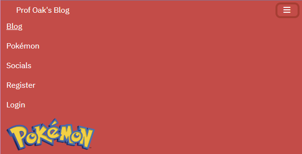

User message :

- Shows a little badge underneath the pokemon logo in the nav bar, if a user is logged in or not.

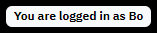

Footer :

- Footer contains three links that direct to other pokemon websites.

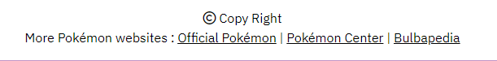

[Back to Top](#professor-oaks-blog)

## Blog

Blog :

- The main page is the blog page. It shows blogs in sets of 6 or less. Each blog card links to that blog post details.

- Each post contains that post details, and at the bottom shows how many comments have been posted on this post.

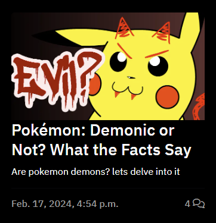

Blog navigation :

- Blog post navigation. If the user is on the last page, the next button dissapears and vice versa.

[Back to Top](#professor-oaks-blog)

## Post details

Post :

- Shows all the details from a post.

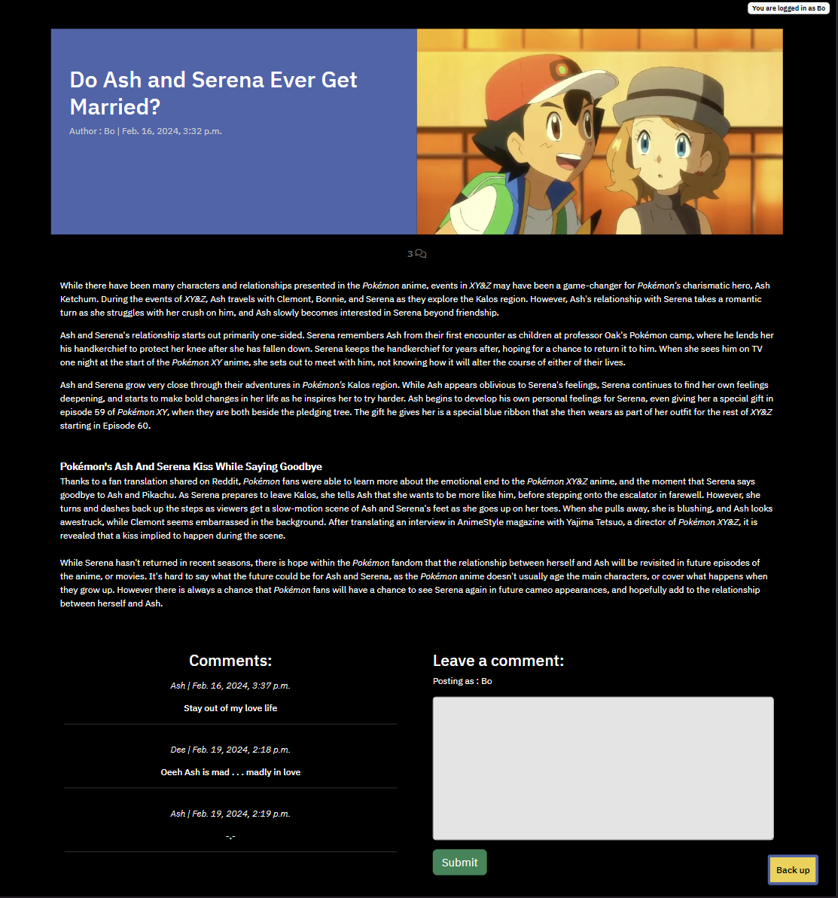

- Under the masthead, is a icon with how many comments have been posted on the post.

- A back to the top button shows as soon as the user starts scrolling, when clicked the screen will go to the top of the page.

Comments :

- Shows a list of all comments made on this post. Each post links to that users profile.

- If no comments have been posted yet, a message is shown.

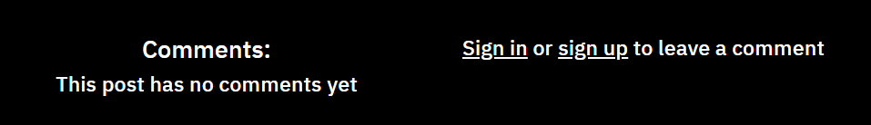

- Each post contains as form where logged in users can post comments.

- If the user isn't logged in, a message is shown with links to the sign up and sign in page.

- After a post is submitted a success message is shown.

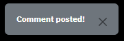

- A user can delete or edit their own comments.

- When a user clicks the delete button, a modal pops up.

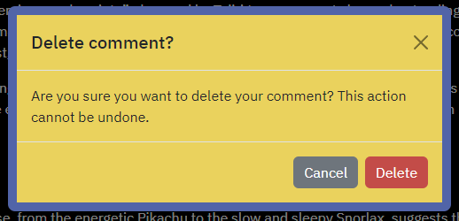

- Then when delete is clicked once more a success message is shown.

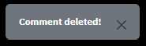

- When the user updates their comment, the form will be filled out with this comment and is ready for editing.

- When the comment is updated a success message is shown.

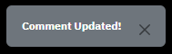

[Back to Top](#professor-oaks-blog)

## Pokemon

Pokemon database :

- Shows all generation 1 pokemon that when clicked, link to their corresponding website page in the pokemondb website.

- A back to the top button shows as soon as the user starts scrolling, when clicked the screen will go to the top of the page.

[Back to Top](#professor-oaks-blog)

## Socials

Socials :

- Each user card shows details of their favourite pokemon and how many users follow them and how many users they follow.

- A back to the top button shows as soon as the user starts scrolling, when clicked the screen will go to the top of the page. Each user card links to that users profile and each comment links to that post where the comment was posted.

Socials not logged in :

- When a user isn't logged in, they only see all users and a message on the top that links to the sign up and sign in pages.

Socials logged in :

- When the user is logged in, the socials page will show all users and all comments posted by users the logged in user follows.

- If the logged in user doesn't follow anyone, it'll show a message.

[Back to Top](#professor-oaks-blog)

## Profiles

User profiles :

- When the user list button is clicked, the user will be directed back to the socials page. Each user has their image and favourite pokemon shown on their profile.

- Each profile has a follows and followers list.

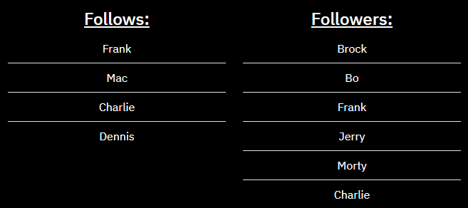

- If a user doesn't follow anyone or noone follows the user, a message is shown.

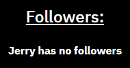
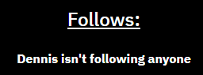

- Each profile shows all comments posted by that user.

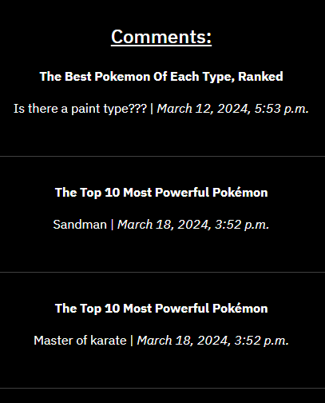

- If the user hasn't commented yet, a message is shown.

Friend profile :

- When a user is logged in and looks at another users profile, the follow or unfollow button is shown. When a user isn't logged in, the follow or unfollow button dissapear.

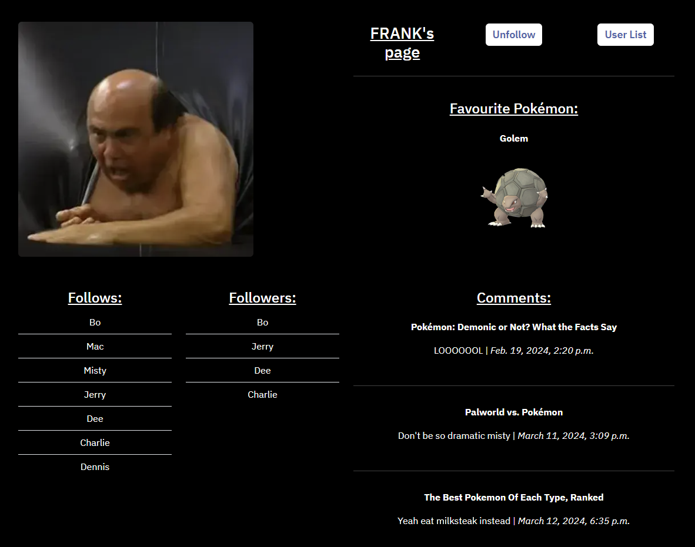

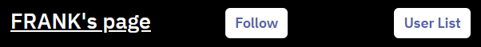
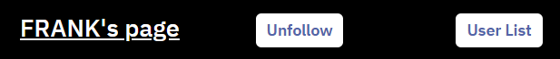

- When a logged in user follow or unfollows a user, a message is shown.

My profile :

- The profile of a logged in user shows an update button and a delete profile button.

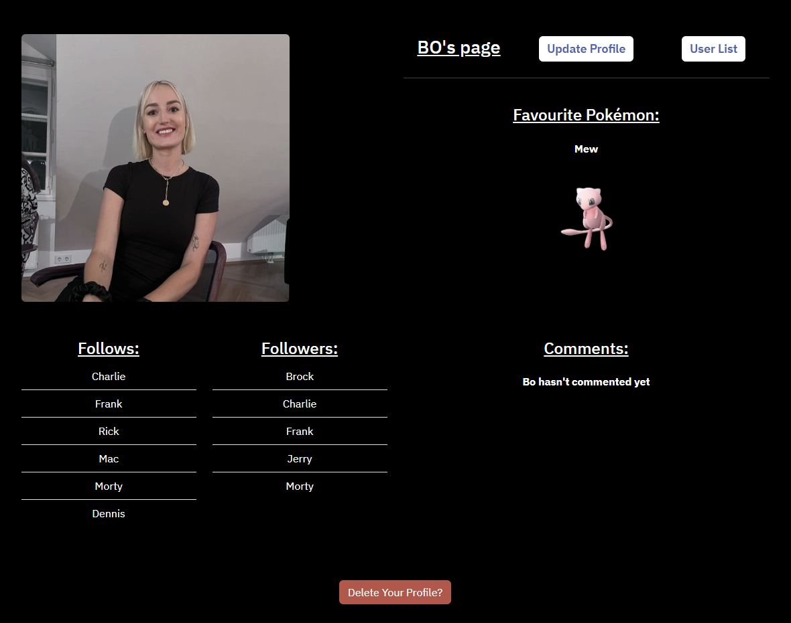

- When a user clicks the update button, the user will be directed to another page where the user can update their image and favourite pokemon.

- After the user updates their profile, a success message is shown.

- When the delete your profile button is clicked a delete modal will pop up.

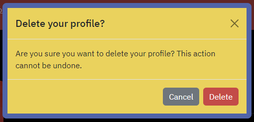

- After the user clicked the delete button in the delete profile modal, a message will be shown.

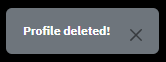

[Back to Top](#professor-oaks-blog)

## Sign in, sign out and sign up

Sign in :

- If the user already has a profile, they can click on the sign in link in the nave bar and sign in.

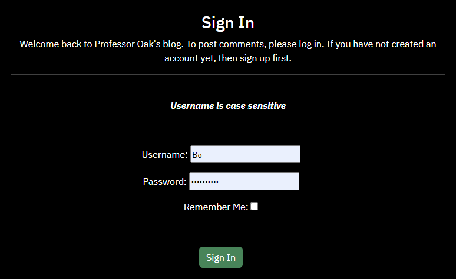

- After the user is signed in, a success message is shown.

Sign up :

- When the user wants to create a profile, they'll have to click on the register link in the nav bar. When they fill out the form and press sign up, a profile is automatically made and they will be signed in.

- After the user is signed up, a success message is shown.

- The profile that is created gets the default profile image and default favourite pokemon.

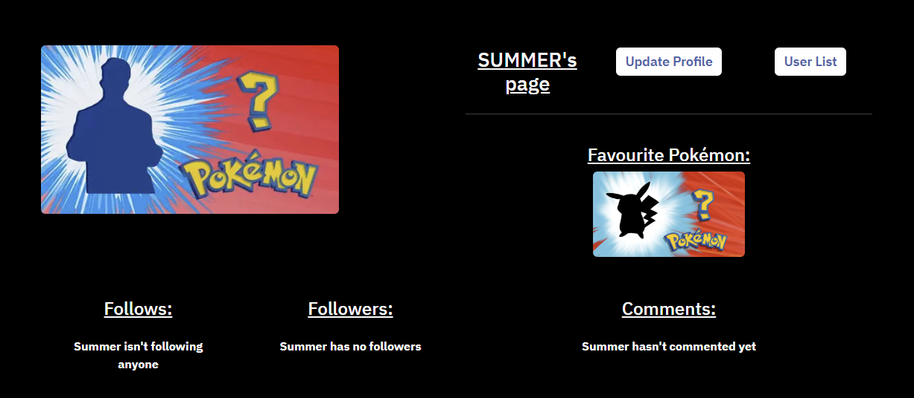

Sign out :

- When the logged in user clicks log out in the nav bar, they'll be navigated to the sign out page. The user is signed out and redirected to the blog when the sign out button is clicked

- After the user is signed out, a success message is shown.

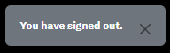

[Back to Top](#professor-oaks-blog)

 

# Future features

Main :
- I want to add a search bar in the nav bar, that searches blogs and users

Blog :
- I want users to like and dislike blog posts.
- Users can like and dislike comments.

Database :
- I want the pokemon database to show all pokemon, not just generation 1.
- If a pokemon in the pokemon database is clicked, a modal with more info will show instead of a link to a different website.
- I want all the pokemon in the pokemon database that are favourited have a little loveheart, that can then be clicked to show all people who favourited this pokemon.
- Users can like and dislike pokemon.
- Users can comment on pokemons to start discussions.

Socials :
- I want users to be able to comment on each others profiles
- These comments will show in the socials page as well as the users own page.
- The users likes and dislikes are shown on their profile

[Back to Top](#professor-oaks-blog)

 

# Design

### Colour scheme

I wanted to keep the colours fun and matching with the pokemon theme. The main pages follow the design of a pokeball, red - black - white. Other features like the back up button and the delete modal follow the pokemon logo colours, blue - yellow

 

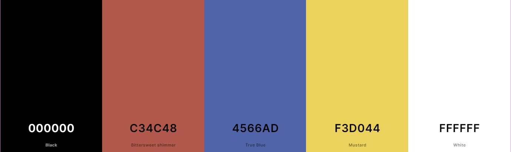

### Images

The images from the posts come from the websites that I got the post content from. They are linked in the credits section.

images and gif :

- [Pokemon logo](https://en.wikipedia.org/wiki/Pok%C3%A9mon)
- [person?](https://9gag.com/gag/aM4wexM)
- [pokemon?](https://www.polygon.com/2017/2/15/14615360/whos-that-pokemon-meme-creator)
- [Ash](https://mynintendonews.com/2023/10/07/pokemon-pays-tribute-to-ash-ketchums-25-year-journey/)
- [Misty](https://gamerant.com/pokemon-misty-anime-full-lore-history/)
- [Brock](https://www.reddit.com/r/MyHeroAcadamia/comments/17840ts/will_they_get_along_brock_pokemon/)
- [Oak](https://screenrant.com/pokemon-things-you-did-not-know-about-professor-oak-willow/)
- [Dennis](https://www.reddit.com/r/cars/comments/6y5a7v/what_year_and_model_range_rover_is_this_dennis/)
- [Dee](https://www.reddit.com/r/IASIP/comments/sl7bjs/sweet_dee_with_her_gorgeous_flojo_nails_10_years/)
- [Frank](https://www.joe.co.uk/entertainment/11-times-frank-reynolds-was-the-most-disgustingly-hilarious-man-on-television-208751)
- [Charlie](https://hellyeahcharlieday.tumblr.com/post/170055955219/charilework-which-charlie-kelly-are-you)
- [Mac](https://www.thewrap.com/rob-mcelhenney-fat-weight-always-sunny/)
- [Rick](https://tvtropes.org/pmwiki/pmwiki.php/Characters/RickAndMortyRickSanchez)
- [Morty](https://tvtropes.org/pmwiki/pmwiki.php/Characters/RickAndMortyMortySmith)
- [Jerry](https://ricksanchez.fandom.com/wiki/Jerry_Smith)
- [Gif](https://www.youtube.com/watch?v=vzCAgHASh_U&list=PLT6LA7qWKxZoJJAUZgXHQ0m6UMP8cPBMX&index=25)

[Back to Top](#professor-oaks-blog)

 

# Technologies used

- This project is written with Python, JavaScript, CSS and HTML.
- [Django](https://www.djangoproject.com/) and [Bootstrap](https://getbootstrap.com/) were used as a framework.
- [ElephantSQL](https://customer.elephantsql.com/) was used to store my databases to.
- [Cloudinary](https://cloudinary.com/) was used to for storing the websites images.
- [Github](https://github.com/) was used to create a repository with the help of The Code Institute template.
- [Heroku](https://heroku.com/) was used to deploy my blog.
- [Visual Studio Code](https://code.visualstudio.com/) is where I did all my coding.
- [Favicon](https://favicon.io/) was used to create a unique favicon for this blog.
- [Pickcoloronline](https://pickcoloronline.com/) was used to get exact colour matches.
- [Coolers](https://coolors.co/) was used to create a colour pallate.
- [Image Resizer](https://imageresizer.com/) was used to change all images to webp files.

## balsemiq

I ended up slightly veering away from the original design, only because I miscalculated the time I needed for each feature. I have placed these features into the future features list, seeing as that I still want to add these features in the future.

Home page :

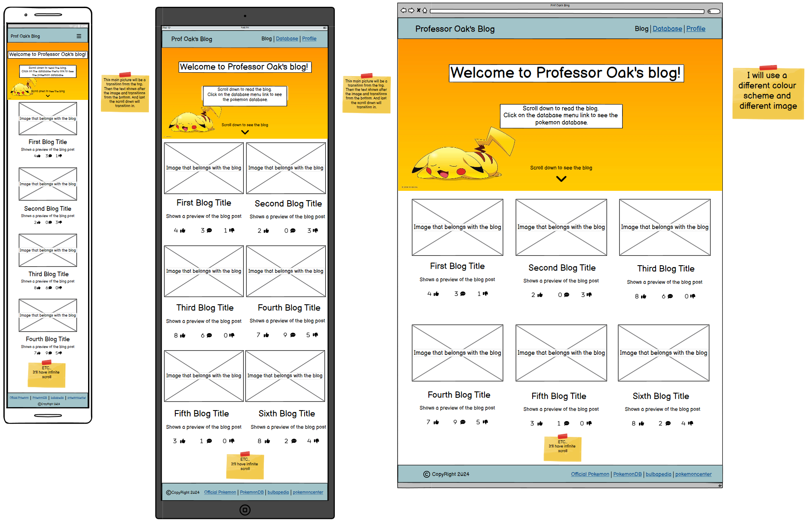

Pokemon Database :

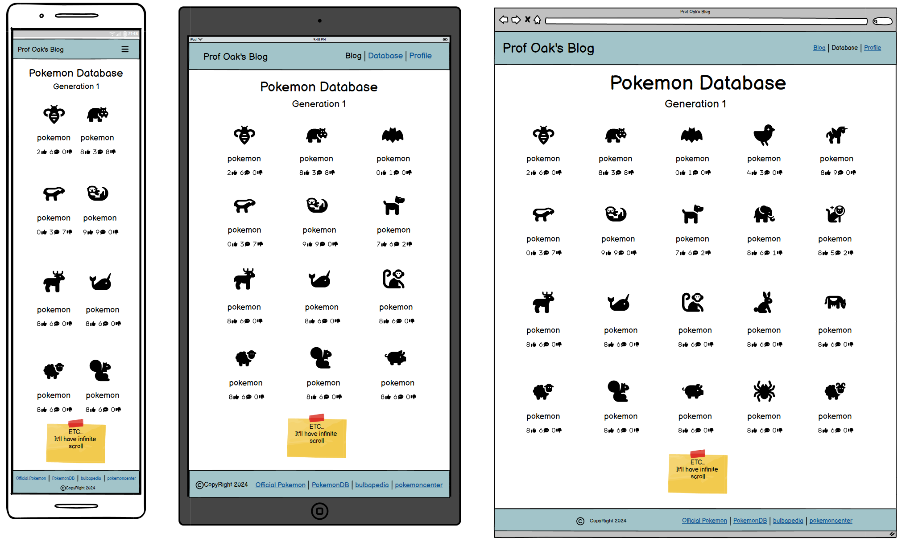

Socials profiles :

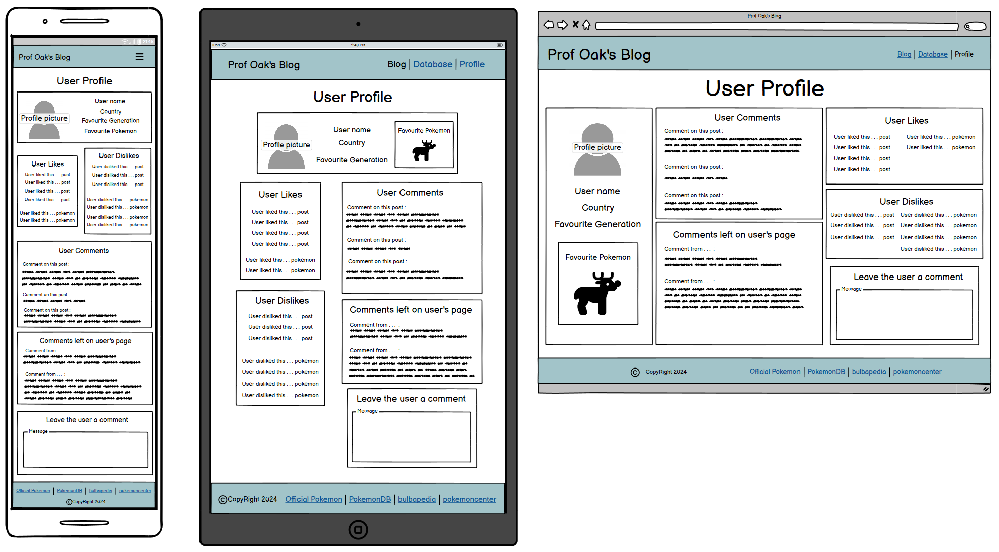

[Back to Top](#professor-oaks-blog)

## Lucid Flowchart

Post model diagram :

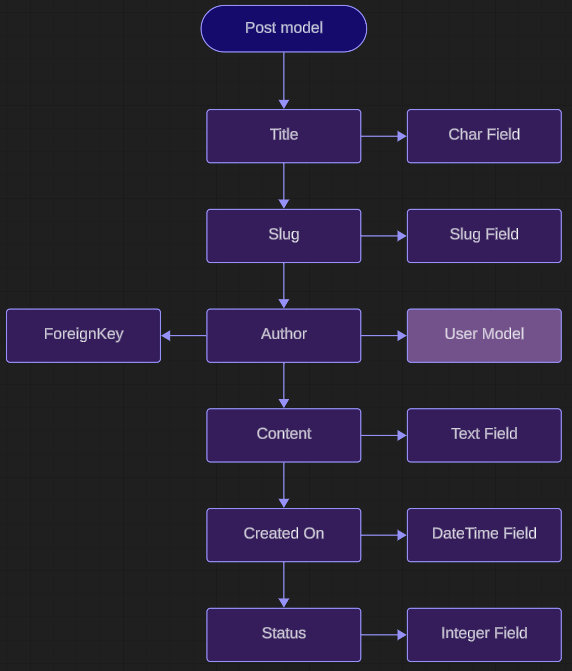

Comment model diagram :

PokeDatabase model diagram :

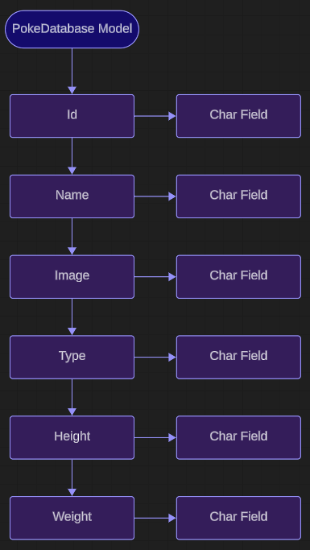

Socials model diagram :

[Back to Top](#professor-oaks-blog)

## Libraries

- [bleach](https://pypi.org/project/django-bleach/) was used as a Python module that takes any HTML input, and returns valid, sanitised HTML.
- [crispy-bootstrap4](https://pypi.org/project/crispy-bootstrap4/) was used as a template pack for the comment form.
- [dj-database-url](https://pypi.org/project/dj-database-url/) was used to utilize the DATABASE_URL environment variable.
- [django-allauth](https://docs.allauth.org/en/latest/) was used for authentication, registration and account management.
- [gunicorn](https://gunicorn.org/) was used for the Python WSGI HTTP Server for UNIX.
- [psycopg2](https://pypi.org/project/psycopg2/) was used as a PostgreSQL database adapter.
- [Requests](https://requests.readthedocs.io/en/latest/) was used as HTTP library for Python.
- [sqlparse](https://pypi.org/project/sqlparse/) was used as a non-validating SQL parser for Python.
- [summernote](https://summernote.org/) was used as a WYSIWYG editor with Bootstrap.
- [whitenoise](https://pypi.org/project/whitenoise/) was used as a simplified static file serving for Python web apps.

[Back to Top](#professor-oaks-blog)

 

# Testing

All the tests are in the [TEST.md](TEST.md) file.

 

# Bug fixes

- I had accidentally added the path to the post_detail page outside of the urlpatterns brackets.
- There was a bug that would throw an error when the socials page is clicked when a user isn't logged in. That got fixed with an if else statement.
- If a user would comment on a post and then refresh, the comment would duplicate. I had to add HttpResponseRedirect to the comment form.
- After I would update my profile picture it would return me to the incorrect user profile. I had to return the correct user pk.
- The update profile message wans't showing, I had placed the message code in the wrong section.
- The edit comment button stopped working, because I had accidentally deleted the .id in the comment.
- I wasn't able to test the first time, with the help of a tutor from the code institute. We figured out it was an migration issue and a database issue.
- A user could update other peoples profiles when adding /update_profile/(user pk number). I had deleted a previous solution to this, because it wasn't working on VS Code. Turns out I had placed the UserPassesTestMixin in the wrong order. So I added it back in.

<b>I have not noticed any existing bugs.</b>

[Back to Top](#professor-oaks-blog)

 

# Deployment

## Heroku deployment

To deploy Your App to Heroku, you have to :
- Create a Heroku account.
- From the dashboard select create new app.
- Enter a name for your app, it needs to be unique, and select your region then press create app.
- Select settings at the top of your app page.
- Press reveal config vars.
- If the user is using google sheets in their project, you'll have to name your credentials file in the key input and copy and paste that credential file in the value input.
- Also add PORT in key input and 8000 as value input.
- Scroll down and press the add buildpack button.
- From here press the Python icon and then the add buildpack button.
- Add another builpack and press the Nodejs icon this time and then press add buildpack button again.
- Scroll back up and select Deploy at the top of your app page.
- Choose your deployment method, when choosing Github, you will have to connect to your account.
- Then choose which repo you want to deploy and connect to it.
- Choose if you want to deploy automatic or manual, and press deploy.

## Github deployment

To fork this repository on Github, you have to :
  - Go to my [GitHub repository called PP4](https://github.com/ObiWanBonobi/PP4).
  - In the top-right corner of the page, click Fork.
  - Under "Owner," select the dropdown menu and click an owner for the forked repository.
  - By default, forks are named the same as their upstream repositories. Optionally, to further distinguish your fork, in the "Repository name" field, type a name.
  - Click Create fork.

To clone this repository, you have to :
  - Go to my [GitHub repository called PP4](https://github.com/ObiWanBonobi/PP4).
  - Above the list of files, click  Code.
  - Copy the URL for the repository.
  - Open Git Bash.
  - Change the current working directory to the location where you want the cloned directory.
  - Type git clone, and then paste the URL you copied earlier.
  - Press Enter to create your local clone.

You can see the deployed blog [here](https://prof-oaks-blog-0421d28e5692.herokuapp.com/).

[Back to Top](#professor-oaks-blog)

 

# Credits

- <b>Inspiration and code</b> : I got most of my code and inspiration from 2 different walkthroughs that I combined, [Code Institute Blog](https://github.com/Code-Institute-Solutions/blog) and [Django Social Network](https://realpython.com/django-social-network-1/).
- <b>Django</b> : I learned a lot from the [official Django website](https://www.djangoproject.com/).
- <b>Json file</b> : I got the pokemon data for my json file, from this [pokemon database on github](https://github.com/sohailpervaiz/pokemon-database).
- <b>Blogs</b> : I got all the blog content from the following websites:
    * https://www.ign.com/articles/palworld-vs-pokmon-comparison-just-how-similar-are-the-designs
    * https://screenrant.com/pokemon-first-created-rhydon-original-design-dinosaur/
    * https://gamerant.com/pokemon-generation-one-popular-rumors-everyone-believed/#mew-under-the-truck
    * https://screenrant.com/pokemon-ash-serena-married-xyz-anime/
    * https://theconversation.com/pokemons-ash-wins-world-championship-after-25-years-heres-why-the-franchise-is-still-capturing-fans-194788
    * https://gamerant.com/best-pokemon-each-type/#fire-ndash-charizard
    * https://gamerant.com/pokemon-ash-ketchum-most-used-types/#flying---13
    * https://www.zavvi.com/blog/gaming/the-top-10-most-powerful-pokemon/#:~:text=Arceus&text=By%20far%20the%20most%20naturally,to%20control%20other%20Legendary%20Pok%C3%A9mon.
    * https://www.zavvi.com/blog/features/pokemon-game-fan-theories/
    * https://www.wikihow.com/Is-Pokemon-Demonic
    * https://gamerant.com/pokemon-worst-type-combinations-ranked/#bug-grass
    * https://gamerant.com/pokemon-trainers-anime-ash-better-worse-beat/#can-39-t-beat-ash-jessie-and-james

- <b>Most of my credit goes to the Code Institute program where I made notes on every section and got most of my ideas and code from there.</b>

[Back to Top](#professor-oaks-blog)