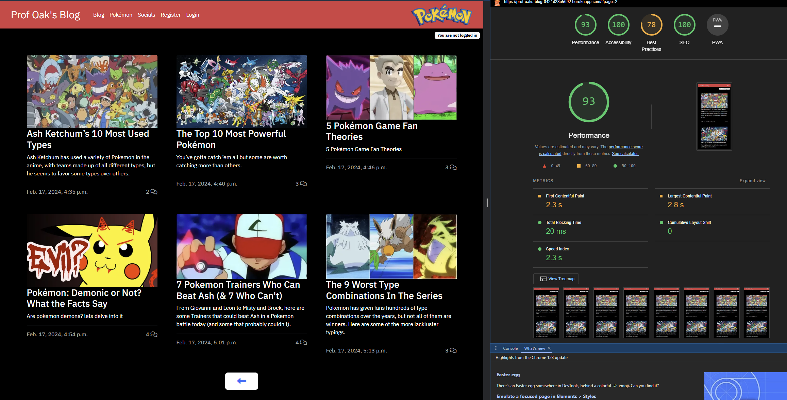
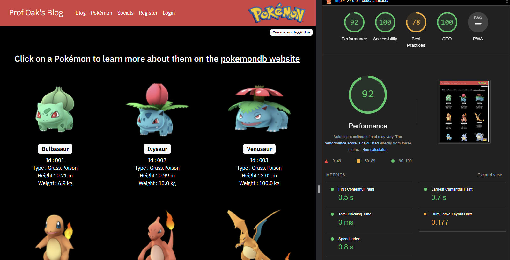
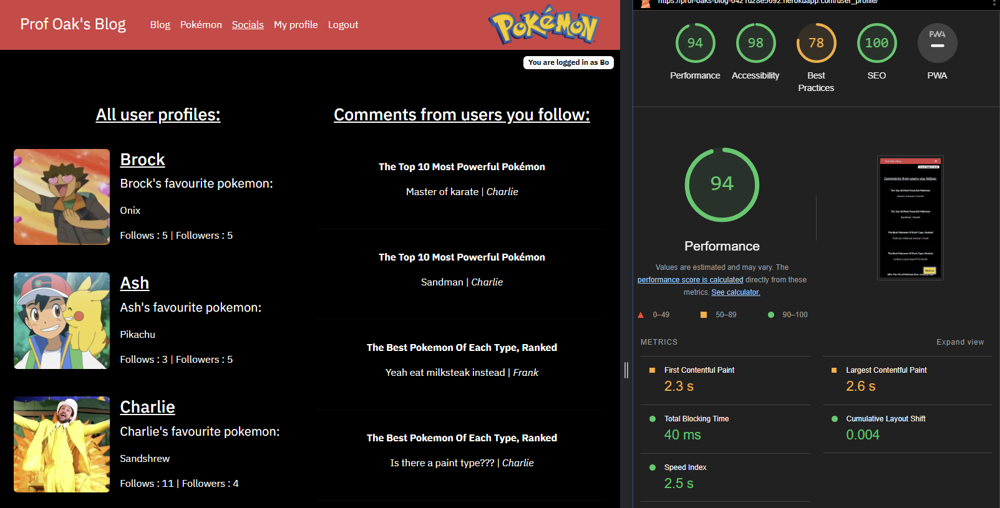
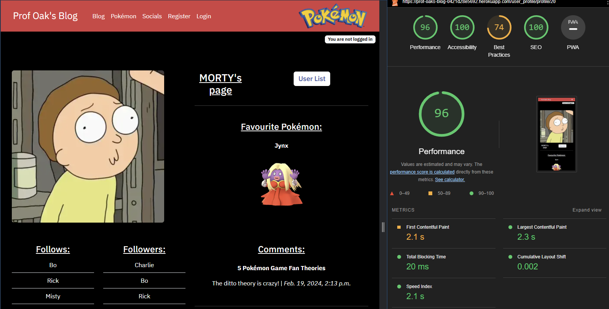
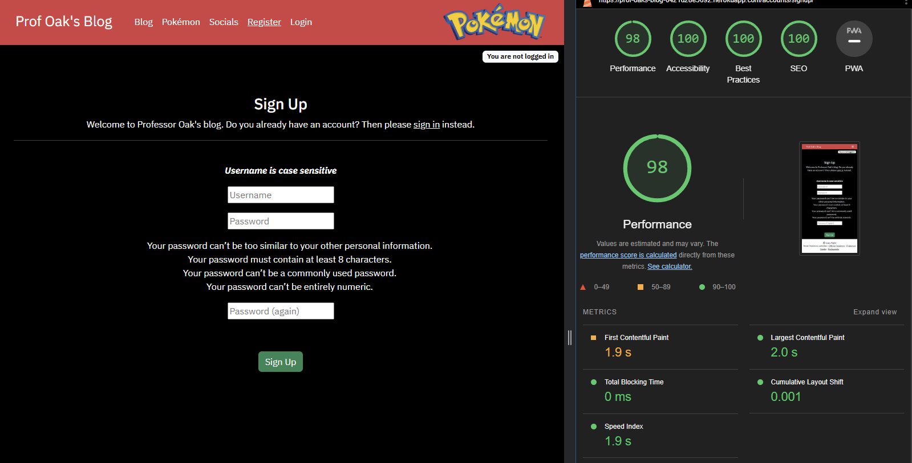
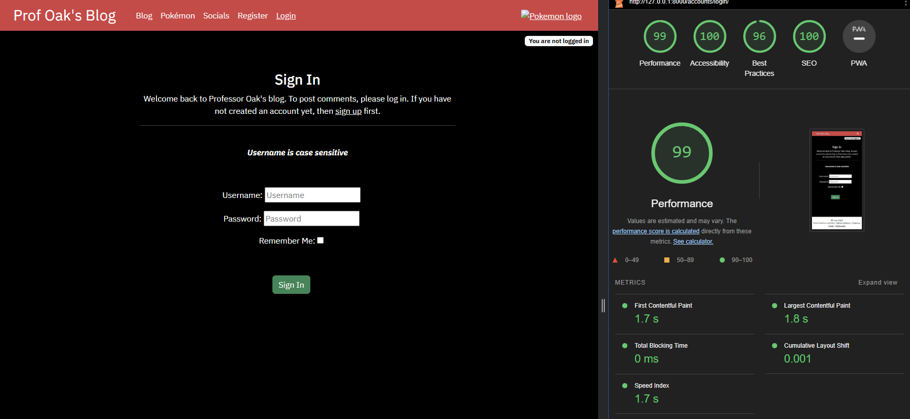

# Professor Oak's Tests

Click [here](README.md) to go back to the README.md file.

## Content

- [Validation](#validation)
    * [HTML Validation](#html-validation)
    * [CSS Validation](#css-validation)
    * [JavaScript experience](#javascript-validation)
    * [Python Validation](#css-validation)
    * [CSS Validation](#css-validation)
- [Manual Testing](#manual-testing)
    * [Test base](#tests-for-the-basehtml-file-these-features-are-in-every-page)
    * [Test blog](#tests-for-the-blog-indexhtml-page-containing-all-the-published-blog-posts)
    * [Test post](#tests-for-the-blog-post_detailhtml-page-containing-the-blog-posts-details)
    * [Test pokemon](#tests-for-the-pokemon-databasehtml-page-this-contains-all-pokemon)
    * [Test socials](#tests-the-socialshtml-page-contains-all-users-and-when-logged-in-user-following-comments)
    * [Test profiles](#tests-for-user-profilehtml-page-contains-the-users-details)
    * [Test sign options](#tests-the-signuphtml-signinhtml-and-logouthtml-page-here-the-logged-in-user-will-sign-out)
    * [Test admin](#tests-admin-page)
- [Lighthouse Testing](#lighthouse-testing)

 

# Validation

## HTML Validation

[W3C validator](https://validator.w3.org/) was used to check the HTML files. I had placed buttons inside of anchor elements that came up as an error, they got changed into div's. I had also accidentally left an extra \</script> endtag, that also got deleted. The other errors that were shown, are related to Django.

HTML files tested

| **File** | **Template** | **Result** |
|---|---|---|
| templates | base.html | &#10004; |
| templates | login.html | &#10004; |
| templates | logout.html | &#10004; |
| templates | signup.html | &#10004; |
|-|-|-|
| blog | index.html | &#10004; |
| blog | post_detail.html | &#10004; |
|-|-|-|
| database | database.html | &#10004; |
|-|-|-|
| user_profile | socials.html | &#10004; |
| user_profile | profile.html | &#10004; |
| user_profile | update_profile.html | &#10004; |

[Back to Top](#professor-oaks-tests)

## CSS Validation

[Jigsaw W3C validator](https://jigsaw.w3.org/css-validator/) was used to check the CSS file. No errors were found.

CSS files tested

| **Parent File** | **File** | **Result** |
|---|---|---|
| static | style.css | &#10004; |

[Back to Top](#professor-oaks-tests)

## JavaScript Validation

[JShint](https://jshint.com/) was used to check my JavaScript files. I had missed one semicolon and that was it.

JavaScript files tested

| **Parent File** | **File** | **Result** |
|---|---|---|
| static | comments.js | &#10004; |
| static | delete_profile.js | &#10004; |
| static | top_button.js | &#10004; |

[Back to Top](#professor-oaks-tests)

## Python Validation

[CI Python Linter](https://pep8ci.herokuapp.com/) was used to check every python file. I fixed all the lines that were too long

Python files tested

| **App** | **File** | **Result** |
|---|---|---|
| profoak | settings.py | &#10004; |
| profoak | urls.py | &#10004; |
|-|-|-|
| blog | admin.py | &#10004; |
| blog | forms.py | &#10004; |
| blog | models.py | &#10004; |
| blog | urls.py | &#10004; |
| blog | views.py | &#10004; |
|-|-|-|
| database | admin.py | &#10004; |
| database | models.py | &#10004; |
| database | urls.py | &#10004; |
| database | views.py | &#10004; |
|-|-|-|
| user_profile | admin.py | &#10004; |
| user_profile | models.py | &#10004; |
| user_profile | urls.py | &#10004; |
| user_profile | views.py | &#10004; |

[Back to Top](#professor-oaks-tests)

# Manual Testing

### Tests for the base.html file. These features are in every page.

Navigation when logged in as a user

| **Test** | **Expected** | **Result** |
|---|---|---|
| Click on Prof's Oak's Blog title | When clicked navigates the user to the blog page | &#10004; |
| Click on Blog navigation link | When clicked navigates the user to the Blog page | &#10004; |
| Click on Pokemon navigation link | When clicked navigates the user to the Pokemon Database page | &#10004; |
| Click on Socials navigation link | When clicked navigates the user to the Socials page | &#10004; |
| Click on My Profile navigation link | When clicked navigates the user to the | &#10004; |
| Click on Logout navigation link | When clicked navigates the user to the | &#10004; |
| Click on Pokemon Logo | When clicked navigates the user to the Pokemon database | &#10004; |

Navigation when not logged in as a user

| **Test** | **Expected** | **Result** |
|---|---|---|
| Click on Prof's Oak's Blog title | When clicked navigates the user to the Blog page | &#10004; |
| Click on Blog navigation link | When clicked navigates the user to the Blog page | &#10004; |
| Click on Pokemon navigation link | When clicked navigates the user to the Pokemon Database page | &#10004; |
| Click on Socials navigation link | When clicked navigates the user to the Socials page | &#10004; |
| Click on Register navigation link | When clicked navigates the user to the Sign Up page | &#10004; |
| Click on Login navigation link | When clicked navigates the user to the Log In page | &#10004; |
| Click on Pokemon Logo | When clicked navigates the user to the Pokemon database page | &#10004; |

Body main, top right message

| **Test** | **Expected** | **Result** |
|---|---|---|
| Not logged in message | If the user isn't logged in, will show a small badge with a message | &#10004; |
| Logged in message | If the user is logged in, will show a small badge with a message containing the users name | &#10004; |

Footer

| **Test** | **Expected** | **Result** |
|---|---|---|
| Click on the Official Pokemon link | When clicked navigates the user to the Official Pokemon website | &#10004; |
| Click on the Pokemon Center link | When clicked navigates the user to the Pokemon Center website | &#10004; |
| Click on the Bulbapedia link | When clicked navigates the user to the Bulbapedia website | &#10004; |

[Back to Top](#professor-oaks-tests)

### Tests for the blog index.html page containing all the published blog posts.

Blog posts

| **Test** | **Expected** | **Result** |
|---|---|---|
| Shows all posts | Shows all posts that have been published by the superuser | &#10004; |
| Click on a post | When a post is clicked the user is directed to that posts details page | &#10004; |
| Comment count | At the bottom right of each post, it shows how many comments have been made on that post | &#10004; |

Blog navigation

| **Test** | **Expected** | **Result** |
|---|---|---|
| Click on the next page button | When clicked, the user is taken to the next page of posts | &#10004; |
| Click on the previous page button | When clicked, the user is taken to the previous page of posts | &#10004; |
| If there is no next page | The next button dissapears | &#10004; |
| If there is no previous page | The previous button dissapears | &#10004; |

[Back to Top](#professor-oaks-tests)

### Tests for the blog post_detail.html page containing the blog posts details.

Post details

| **Test** | **Expected** | **Result** |
|---|---|---|
| Shows post details | Shows all details of this post made by the superuser | &#10004; |
| Comment count | Under the blog's title, it'll show how many comments are made on this post | &#10004; |
| Shows comments | Shows all comments that were made on this post | &#10004; |
| Click on comment | When the user clicks on the comment, the user is taken to that comments user profile | &#10004; |
| No comments | If the post has no comments, there will be a message instead | &#10004; |
| Back to top button | Shows when the user scrolls down, when clicked, goes back to the top of the page | &#10004; |

Comments, user logged in

| **Test** | **Expected** | **Result** |
|---|---|---|
| Submit a comment | The user can leave a comment on this post | &#10004; |
| Comment message submit | After the user leaves a comment, there will be a confirmation message at the top | &#10004; |
| Edit your own comments | When edit is clicked the user can edit their comment then press update | &#10004; |
| Comment message edit | After the user edits their comment, there will be a confirmation message at the top | &#10004; |
| Delete your own comments | After delete is pressed, a delete modal will show | &#10004; |
| Delete modal delete | When the delete button is clicked, the users comment will be deleted | &#10004; |
| Delete modal cancel | When the cancel button or the cross button is clicked, the users comment stays and modal closes | &#10004; |
| Comment message delete | After the user deletes their comment, there will be a confirmation message at the top | &#10004; |

Comments, user not logged in

| **Test** | **Expected** | **Result** |
|---|---|---|
| Leave comment | Instead of showing the leave comment form, it'll show a message with two links | &#10004; |
| Sign in link | The link navigates the user to the sign in page | &#10004; |
| Sign up link | The link navigates the user to the sign up page | &#10004; |

[Back to Top](#professor-oaks-tests)

### Tests for the Pokemon database.html page, this contains all pokemon.

Pokemon database

| **Test** | **Expected** | **Result** |
|---|---|---|
| Page title | contains a link that navigates to the pokemondb website | &#10004; |
| Pokemon | Shows all pokemon from the json file | &#10004; |
| Click a pokemon | When a pokemon is clicked, the user will be navigated to the pokemondb website for more details on that pokemon | &#10004; |
| Back to top button | Shows when the user scrolls down, when clicked, goes back to the top of the page | &#10004; |

[Back to Top](#professor-oaks-tests)

### Tests the socials.html page, contains all users and when logged in user following comments

Socials

| **Test** | **Expected** | **Result** |
|---|---|---|
| Shows all users | Shows all users when not logged in. Shows all other users when logged in | &#10004; |
| Shows user favourite | Shows users favourite pokemon | &#10004; |
| Shows followers and following | Shows follower and follows count of each user | &#10004; |
| Back to top button | Shows when the user scrolls down, when clicked, goes back to the top of the page | &#10004; |

Comments when user is not logged in

| **Test** | **Expected** | **Result** |
|---|---|---|
| Comment message | Shows a message that contains two links | &#10004; |
| Sign in link | The link navigates the user to the sign in page | &#10004; |
| Create a profile link | The link navigates the user to the sign up page | &#10004; |

Comments when user is logged in

| **Test** | **Expected** | **Result** |
|---|---|---|
| Comments from other users | Shows all comments from users that the logged in user follows | &#10004; |
| Click on comment | When the user clicks on the comment, the user is taken to the post where that user commented | &#10004; |

[Back to Top](#professor-oaks-tests)

### Tests for user profile.html page, contains the users details

User details

| **Test** | **Expected** | **Result** |
|---|---|---|
| User image | Shows the user image or the default image | &#10004; |
| Favourite pokemon | Shows the users favourite pokemon or the default pokemon | &#10004; |
| Click the favourite pokemon | When the pokemon is clicked, the user will be navigated to the pokemondb website for more details on this pokemon | &#10004; |
| User list button | Shows a button that returns the user to the socials page | &#10004; |

Follows and followers

| **Test** | **Expected** | **Result** |
|---|---|---|
| Follows | Shows all users that this user follows | &#10004; |
| Followers | Shows all users that follows this user | &#10004; |
| Click on follow user | When the user clicks on a follow user, the user is taken to that users profile | &#10004; |
| Click on follower user | When the user clicks on a follower user, the user is taken to that users profile | &#10004; |
| No follows | If the user has no follows, there will be a message instead | &#10004; |
| No followers | If the user has no followers, there will be a message instead | &#10004; |

Comments

| **Test** | **Expected** | **Result** |
|---|---|---|
| Comments | Shows all the comments that that user has posted | &#10004; |
| No comments | If that user has posted no comments, there will be a message instead | &#10004; |
| Click on comment | When the user clicks on a comment, the user is taken to the post where that user commented | &#10004; |

User page when logged in

| **Test** | **Expected** | **Result** |
|---|---|---|
| Follow and unfollow | If the user is already following then the unfollow button shows, and vice versa | &#10004; |
| Follow button | The logged in user can follow the user page that their currently on | &#10004; |
| Follow message | After the user follows a user, there will be a confirmation message at the top | &#10004; |
| Unfollow button | The logged in user can unfollow the user page that their currently on | &#10004; |
| Unfollow message | After the user unfollows a user, there will be a confirmation message at the top | &#10004; |

The users own page

| **Test** | **Expected** | **Result** |
|---|---|---|
| Update button | When clicked the user is navigated to the update_profile.html file | &#10004; |
| Delete profile | When clicked will show a delete profile modal | &#10004; |
| Delete modal delete | When the delete button is clicked, the users profile will be deleted | &#10004; |
| Delete modal cancel | When the cancel button or the cross button is clicked, the users profile stays and modal closes | &#10004; |
| Profile deleted | After the user deletes their profile, there will be a confirmation message at the top | &#10004; |
| Profile deleted comments | When a profile is deleted, all their comments get deleted | &#10004; |
| Profile deleted follows | When a profile is deleted, their follows list gets deleted | &#10004; |
| Profile deleted followers | When a profile is deleted, their followers list gets deleted | &#10004; |

Update profile button

| **Test** | **Expected** | **Result** |
|---|---|---|
| Update image | When changed, will show the updated image on the users own profile | &#10004; |
| Update pokemon | When changed, will show the updated favourite pokemon on the users own profile | &#10004; |
| Update message | After the user updates their profile, there will be a confirmation message at the top | &#10004; |

[Back to Top](#professor-oaks-tests)

### Tests the signup.html, signin.html and logout.html page, here the logged in user will sign out

Sign up

| **Test** | **Expected** | **Result** |
|---|---|---|
| Page title | contains a link that navigates to the login.html page | &#10004; |
| Sign up button | When the user creates an account, it'll create a user with a profile and they'll be signed in | &#10004; |
| Sign up message | After the user signs up, there will be a confirmation message at the top | &#10004; |

Sign in

| **Test** | **Expected** | **Result** |
|---|---|---|
| Page title | contains a link that navigates to the signup.html page | &#10004; |
| Sign in button | When the logged in user signs in, they'll be signed in | &#10004; |
| Sign in message | After the user signs in, there will be a confirmation message at the top | &#10004; |

Sign out

| **Test** | **Expected** | **Result** |
|---|---|---|
| Sign out button | When the logged in user clicks the button, they'll be signed out | &#10004; |
| Sign out message | After the user signs out, there will be a confirmation message at the top | &#10004; |

[Back to Top](#professor-oaks-tests)

### Tests admin page

Admin superuser

| **Test** | **Expected** | **Result** |
|---|---|---|
| Create post | The superuser can create blog posts | &#10004; |
| Delete users | The superuser can create delete users | &#10004; |
| Create comments | The superuser can create comments on blog posts | &#10004; |

[Back to Top](#professor-oaks-tests)

# Lighthouse Testing

Blog page

Blog details page

Pokemon page

Socials page

Socials page logged in

Profile page

Profile page logged in

Profile update page

Sign up page

Sign in page

Sign out page

[Back to Top](#professor-oaks-tests)
